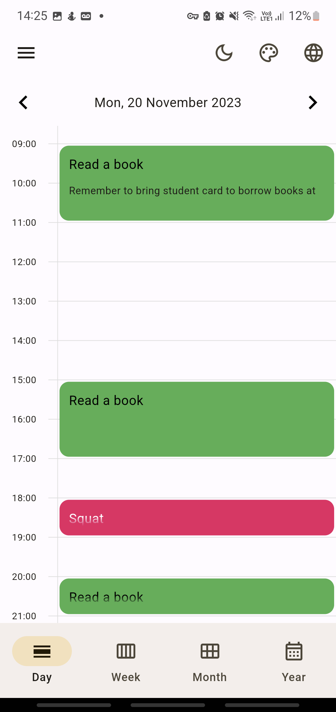
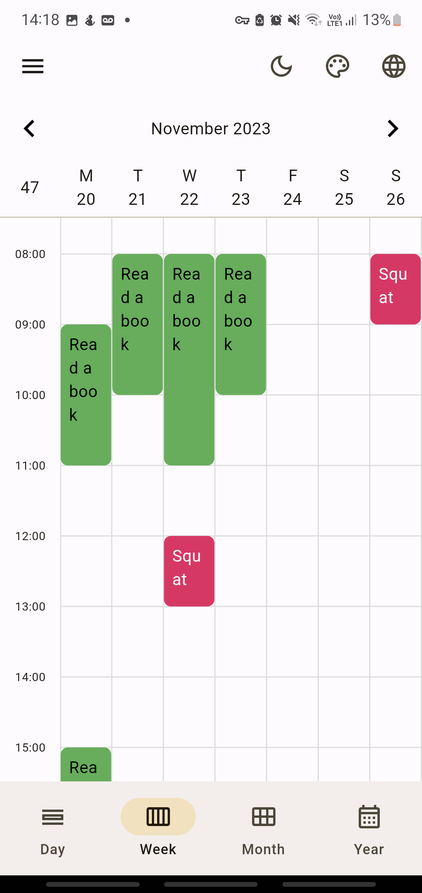
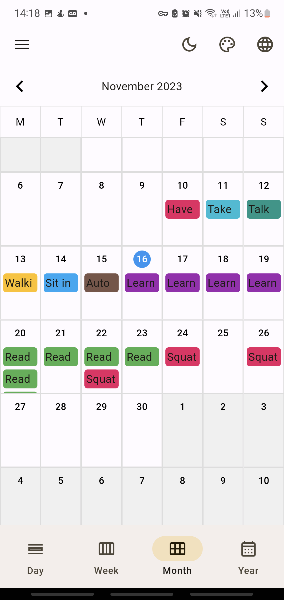
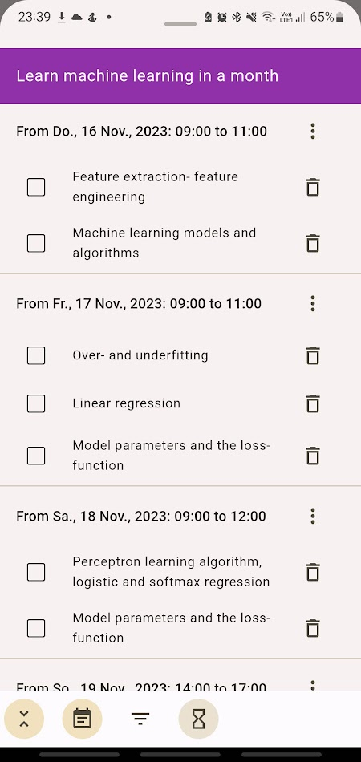
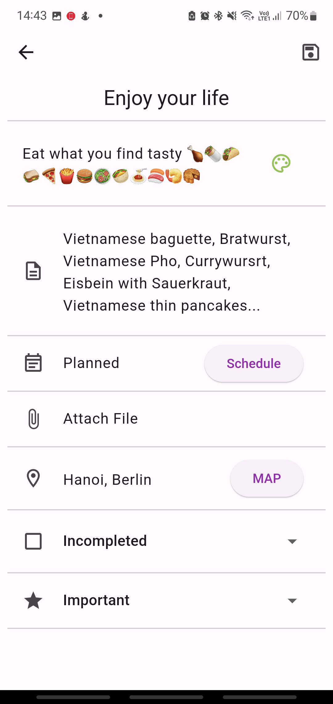
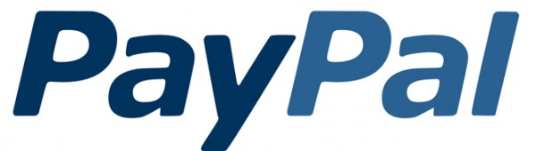

# My Time Manager

Wir zielen darauf ab, die einfachste und dennoch detaillierteste App zu erstellen, um Ihre Zeit für alle Ihre Aktivitäten im Leben zu verwalten. Sie können diese App als To-Do-Liste, Kalender, Gewohnheitstracker, Pomodoro-Timer für den Fokusmodus verwenden und Sie können Statistiken überprüfen, die Ihre Bemühungen zu jedem gegebenen Zeitpunkt widerspiegeln.

Diese App wird kontinuierlich entwickelt und verfeinert. In der Zukunft wird die App auf mehreren Plattformen wie iOS, MacOS, Windows, Linux… verfügbar sein und Sie werden in der Lage sein, Daten über alle Plattformen hinweg zu synchronisieren.

**Free Version**

**Paid Version**

**DER UNTERSCHIED IM VERGLEICH ZU TAUSENDEN ANDEREN ZEITMANAGEMENT-ANWENDUNGEN?**

Diese Anwendung kann Ihnen helfen, jedes Detail in Ihren langfristigen Plänen oder täglichen Aktivitäten auf flexible und natürliche Weise zu erstellen, zu verfolgen und zu bearbeiten.

Zum Beispiel müssen Sie in Ihrem Studium innerhalb eines bestimmten Zeitraums ein Buch lesen.

Tag 1:

Zeit: 9-11 Uhr. Kapitel 1,2 lesen. Ort: Schulbibliothek. Hinweis: Den Studentenausweis mitbringen, um Bücher in der Bibliothek auszuleihen

Zeit: 15-17 Uhr. Kapitel 3 lesen. Ort: Cafeteria.

Zeit: 20-21 Uhr. Weiter Kapitel 3 lesen. Ort: Zuhause.

Tag 2:

Zeit: 8-10 Uhr. Kapitel 4 lesen. Ort: Zuhause.

Tag 3:…

Sie können eine Liste mit dem Namen 'Forschung und Studium' erstellen und eine Aufgabe 'Ein Buch lesen' mit den oben genannten Details hinzufügen. Wenn Sie den Plan für die Aufgabe 'Ein Buch lesen' verfolgen oder ändern möchten, müssen Sie nur auf den Eintrag der Aufgabe 'Ein Buch lesen' klicken und alle Details dieser Aufgabe überprüfen. Sie können auch die Zeitrahmen dieser Aufgabe auf den täglichen, wöchentlichen oder monatlichen Kalenderbildschirmen überprüfen.

Ein weiteres Beispiel für die Verfolgung Ihrer täglichen Aktivitäten. Sie möchten das Squat-Training wie folgt planen:

Montag:

Zeit: 18-19 Uhr. Ziel: mindestens 100 Mal. Ort: Fitnessstudio. Hinweis: Nicht vergessen, eine Wasserflasche mitzubringen!

Mittwoch:

Zeit: 12-13 Uhr. Ziel: mindestens 50 Mal. Ort: Zuhause.

Freitag:

Zeit: ab 18 Uhr - unbekannte Endzeit. Ziel: mindestens 100 Mal. Ort: Zuhause.

Sonntag: …

Sie können eine Liste mit dem Namen ‘Workout’ erstellen und eine quantitative Aufgabe mit dem Titel ‘Squat’ hinzufügen und alle Details im obigen Plan hinzufügen. Ihre Pläne werden wie folgt angezeigt:

    <table>
        <tr>
            <td style="text-align: center">
                
            </td>            
            <td style="text-align: center">
                
            </td>
            <td style="text-align: center">
                
            </td>
        </tr>
        <tr>
            <td style="text-align: center">
                
            </td>
            <td style="text-align: center">
                
            </td>
            <td style="text-align: center">
                
            </td>
        </tr>
    </table>

**“Anwendungsansicht**

    <table>
        <tr>
            <td style="text-align: center">
                
            </td>            
            <td style="text-align: center">
                
            </td>
            <td style="text-align: center">
                
            </td>
        </tr>
        <tr>
            <td style="text-align: center">
                
            </td>
            <td style="text-align: center">
                
            </td>
            <td style="text-align: center">
                
            </td>
        </tr>
    </table>

**Siehe Video**

### Noch zu tun:
Dieses Projekt wird kontinuierlich verfeinert. Einige Interface-Elemente und Funktionen ähnlich wie bei Google Kalender, Samsung Kalender, Microsoft To Do usw. werden nach und nach hinzugefügt und kontinuierlich verbessert.

* ~~Messbare Aufgaben und Aufgaben mit Unteraufgaben hinzufügen.~~
* ~~Die Funktion zum Wechseln zwischen Licht- und Dunkelmodus hinzufügen.~~
* ~~Die Funktion zum Auswählen von Farben für das Thema hinzufügen.~~
* ~~Die Funktion zum Wechseln der Benutzeroberfläche zwischen Material Design 2 und 3 hinzufügen.~~
* ~~Die Funktion zum Auswählen der Sprache hinzufügen.~~
* Dateianhangfunktion für Aufgaben und Ereignisse hinzufügen.
* Alarmfunktion für Aufgaben und Ereignisse hinzufügen.
Kontoerstellungsfunktion und Datensynchronisation mit Firebase hinzufügen.
* Funktion zur Offline-Datensicherung hinzufügen.
* Füge eine Fokus-Timer- und Konzentrationsmusikfunktion hinzu. Erstelle statistische Diagramme von fokussierten Zeiträumen nach Tag, Woche, Monat, Jahr. Füge Tages-, Wochen-, Monats-, Jahresansichten für den Kalender hinzu.
* Füge eine Funktion hinzu, die das Hinzufügen neuer Aufgaben und Ereignisse oder die Planung für vorab erstellte Aufgaben und Ereignisse durch Klicken auf die Zeitschlitze im Kalender ermöglicht.
* Widgets zur Anzeige auf dem Startbildschirm und Sperrbildschirm erstellen.
* Widgets für große Bildschirmtypen von Tablets, Windows, MacOS anpassen.

### Unterstützen Sie uns
Wir hoffen, dass diese Anwendung Ihnen dabei hilft, Ihre Zeit zu verwalten, viele wichtige Ziele im Leben zu erreichen und natürlich, vergessen Sie nicht, sich Zeit zu nehmen, um Ihr Leben zu genießen.

Wir freuen uns zu hören, dass Sie die Anwendung nützlich finden! Ihre Unterstützung und Ihr Feedback werden sehr geschätzt. Wenn Ihnen die App gefällt, bewerten Sie sie bitte im App Store und teilen Sie sie mit Ihren Freunden. Dies hilft uns, mehr Menschen zu erreichen und die App weiter zu verbessern.

Wir verstehen die Bedeutung eines sauberen, werbefreien Benutzererlebnisses und bemühen uns, dies aufrechtzuerhalten. Die Entwicklung und Wartung der App erfordern jedoch finanzielle Ressourcen. Wenn Sie können, ziehen Sie ein Upgrade auf die kostenpflichtige Version der Software in Betracht oder kaufen Sie uns eine Tasse Kaffee. Ihre Unterstützung trägt dazu bei, dass wir die App weiterentwickeln und verbessern können. Vielen Dank!

