# My Time Manager

Chúng tôi đang hướng đến việc tạo ra ứng dụng đơn giản nhất nhưng chi tiết nhất để quản lý thời gian cho tất cả các hoạt động trong cuộc sống của bạn. Bạn có thể sử dụng ứng dụng này như một danh sách công việc cần làm, lịch, theo dõi thói quen, sử dụng đồng hồ pomodoro cho chế độ tập trung, và bạn có thể xem lại các số liệu thống kê phản ánh nỗ lực của bạn vào bất kỳ thời điểm nào.

Ứng dụng này đang được phát triển và cải tiến liên tục. Trong tương lai, ứng dụng sẽ có mặt trên nhiều nền tảng như iOS, MacOS, Windows, Linux… và bạn sẽ có thể đồng bộ dữ liệu trên tất cả các nền tảng.

**Free Version**

**Paid Version**

**“ĐIỂM KHÁC BIỆT SO VỚI HÀNG NGHÌN ỨNG DỤNG QUẢN LÝ THỜI GIAN KHÁC?**

Ứng dụng này có thể giúp bạn tạo, theo dõi và chỉnh sửa mọi chi tiết trong các kế hoạch dài hạn hoặc các hoạt động hàng ngày của bạn một cách linh hoạt và tự nhiên.

Ví dụ, trong việc học tập của bạn, bạn cần đọc một cuốn sách trong một khoảng thời gian nhất định.

Ngày 1:

Thời gian: 9-11h. Đọc chương 1,2. Địa điểm: thư viện trường. Ghi chú: nhớ mang theo thẻ sinh viên để mượn sách tại thư viện

Thời gian: 15-17h. Đọc chương 3. Địa điểm: quán cà phê.

Thời gian: 20-21h. Tiếp tục đọc chương 3. Địa điểm: Tại nhà.

Ngày 2:

Thời gian: 8-10h. Đọc chương 4. Địa điểm: Tại nhà.

Ngày 3:…

Bạn có thể tạo một danh sách có tên 'Nghiên cứu và Học tập' và thêm vào một nhiệm vụ 'Đọc sách' với các chi tiết như trên. Khi bạn muốn theo dõi hoặc thay đổi kế hoạch cho nhiệm vụ 'Đọc sách', bạn chỉ cần nhấn vào mục của nhiệm vụ 'Đọc sách' và xem lại tất cả các chi tiết của nhiệm vụ này. Bạn cũng có thể xem lại các khung thời gian của nhiệm vụ này trên các màn hình lịch hàng ngày, hàng tuần hoặc hàng tháng.

Một ví dụ khác cho việc theo dõi các hoạt động hàng ngày của bạn. Bạn muốn lên kế hoạch cho bài tập Squat như sau:

Thứ Hai:

Thời gian: 18-19h. Mục tiêu: ít nhất 100 lần. Địa điểm: phòng tập gym. Ghi chú: đừng quên mang theo chai nước!

Thứ Tư:

Thời gian: 12-13h. Mục tiêu: ít nhất 50 lần. Địa điểm: tại nhà.

Thứ Sáu:

Thời gian: 18h- không biết thời gian kết thúc. Mục tiêu: ít nhất 100 lần. Địa điểm: tại nhà.

Chủ Nhật: …

Bạn có thể tạo một danh sách có tên 'Workout' và thêm vào một nhiệm vụ định lượng với tiêu đề 'Squat' và thêm vào tất cả các chi tiết trong kế hoạch trên. Các kế hoạch của bạn sẽ được hiển thị như sau:

    <table>
        <tr>
            <td style="text-align: center">
                <a href="./res/example-read-a-book.jpg">
                    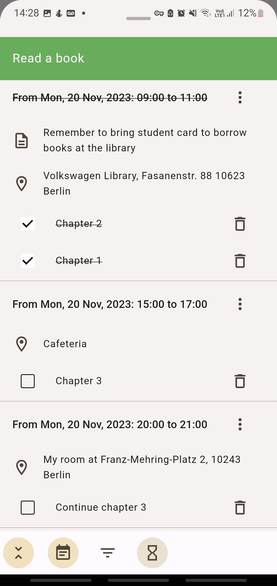
                </a>
            </td>            
            <td style="text-align: center">
                <a href="./res/example-squat.jpg">
                    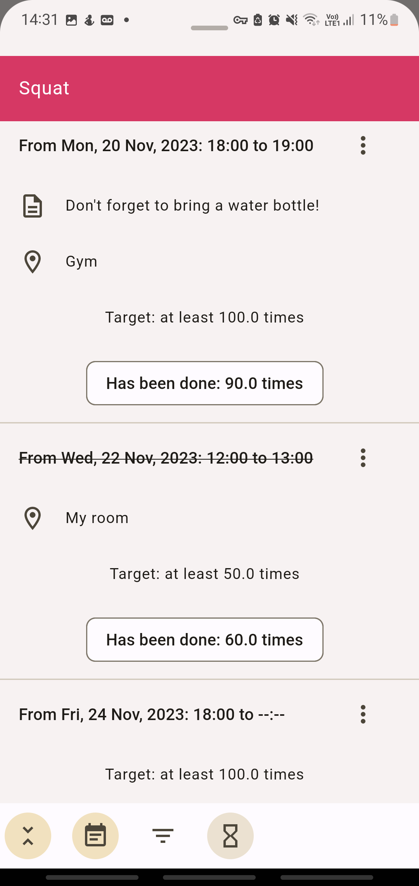
                </a>
            </td>
            <td style="text-align: center">
                <a href="./res/example-timeline-show.jpg">
                    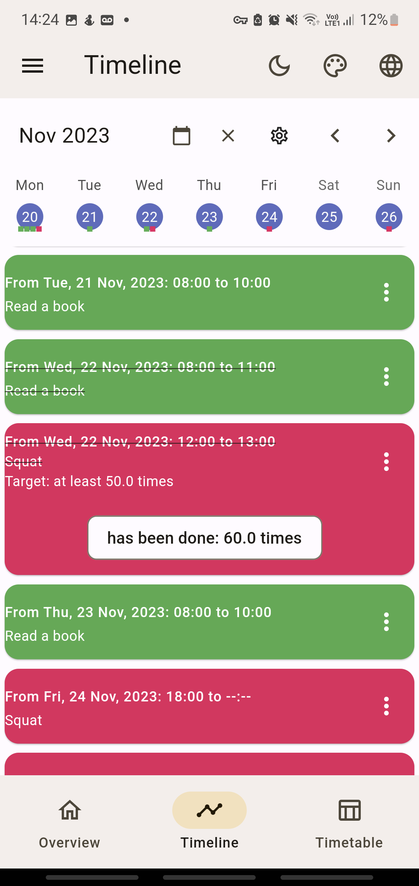
                </a>
            </td>
        </tr>
        <tr>
            <td style="text-align: center">
                <a href="./res/example-daily-view.jpg">
                    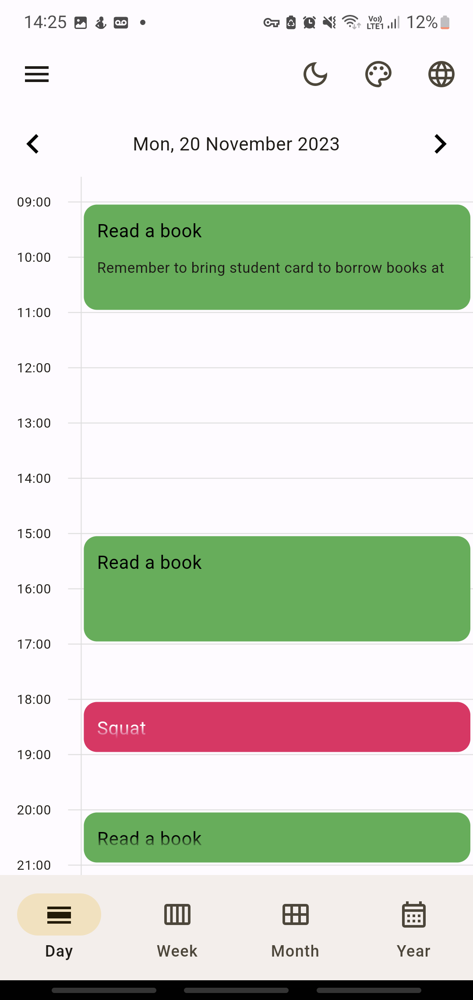
                </a>
            </td>
            <td style="text-align: center">
                <a href="./res/example-weekly-view.jpg">
                    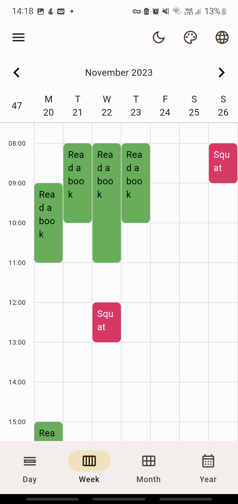
                </a>
            </td>
            <td style="text-align: center">
                <a href="./res/example-monthly-view.jpg">
                    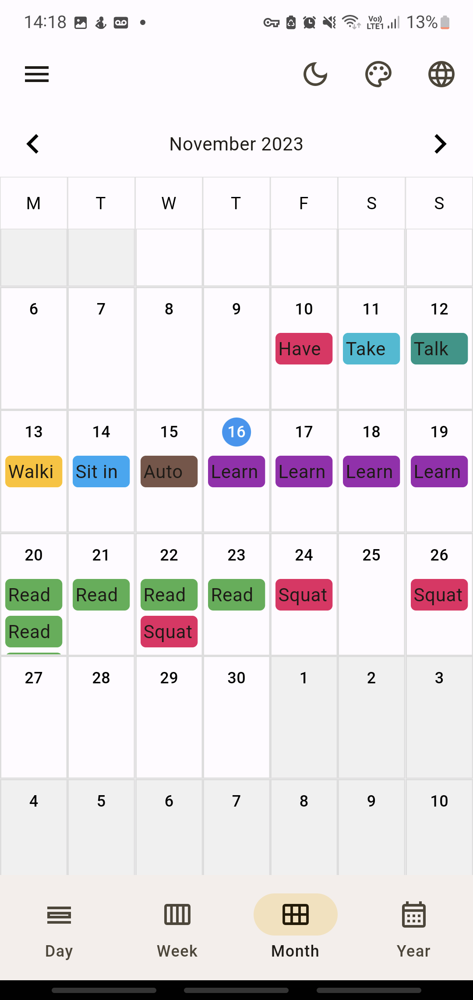
                </a>
            </td>
        </tr>
    </table>

**Application view**

    <table>
        <tr>
            <td style="text-align: center">
                <a href="./res/overview.jpg">
                    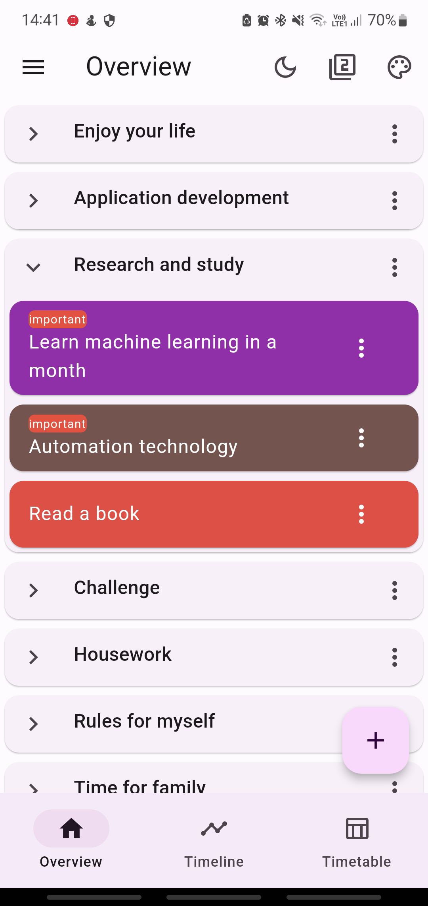
                </a>
            </td>            
            <td style="text-align: center">
                <a href="./res/timeline.jpg">
                    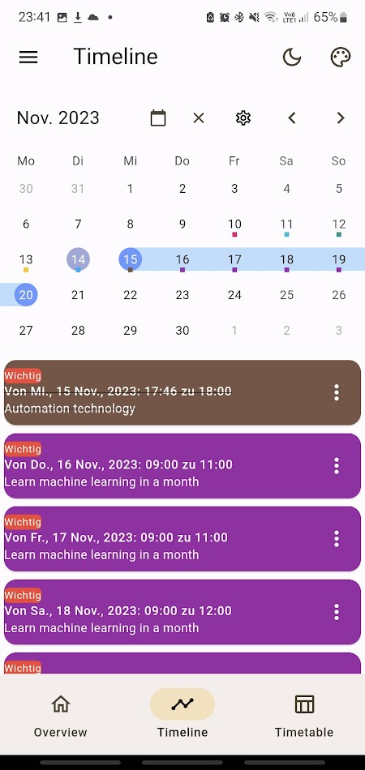
                </a>
            </td>
            <td style="text-align: center">
                <a href="./res/plan-tracking.jpg">
                    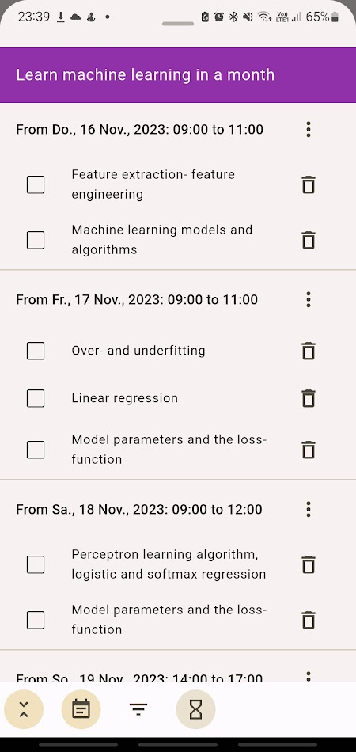
                </a>
            </td>
        </tr>
        <tr>
            <td style="text-align: center">
                <a href="./res/task.jpg">
                    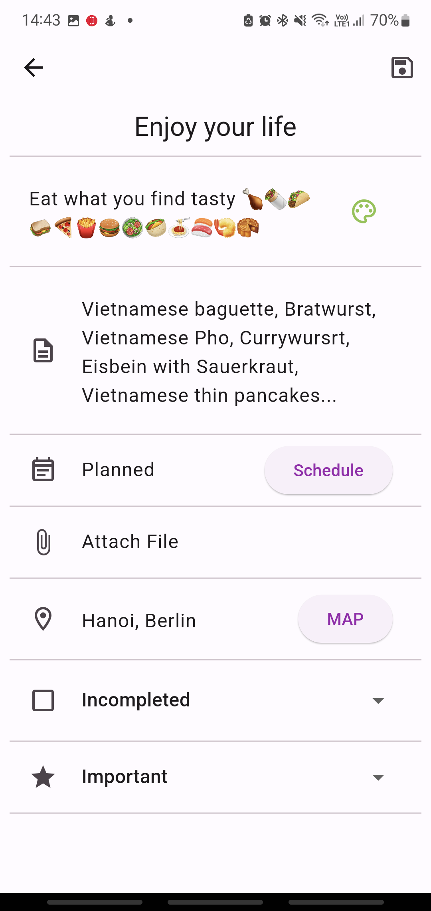
                </a>
            </td>
            <td style="text-align: center">
                <a href="./res/measurabletask.jpg">
                    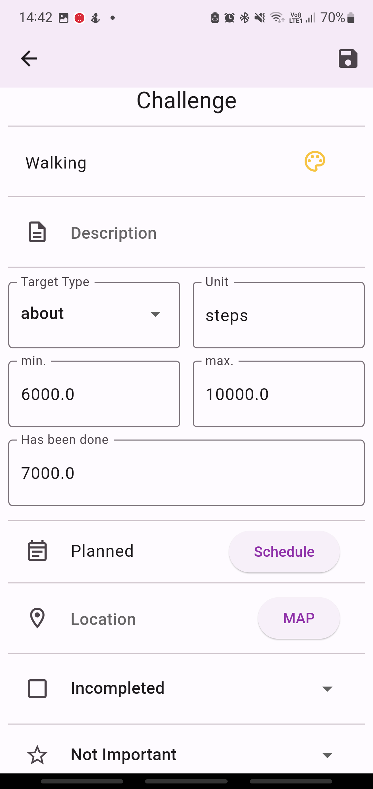
                </a>
            </td>
            <td style="text-align: center">
                <a href="./res/taskwithsubtasks.jpg">
                    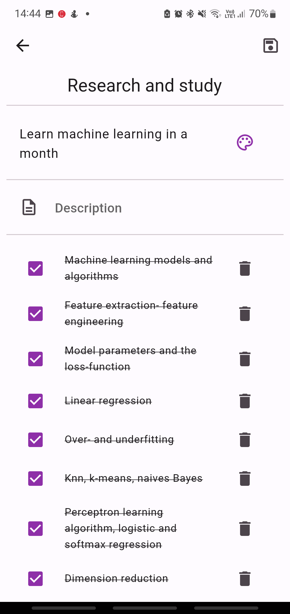
                </a>
            </td>
        </tr>
    </table>

**Xem video**

### Tiếp tục hoàn thiện:
Dự án này đang được cải tiến liên tục. Một số yếu tố giao diện và chức năng tương tự như Google Calendar, Samsung Calendar, Microsoft To Do, v.v., sẽ dần được thêm vào và cải tiến liên tục trong tương lai.

* ~~Thêm các mô hình nhiệm vụ đo lường và nhiệm vụ với các nhiệm vụ phụ.~~
* ~~Thêm chức năng chuyển đổi giữa chế độ sáng và tối.~~
* ~~Thêm chức năng chọn màu sắc cho chủ đề.~~
* ~~Thêm chức năng chuyển đổi giao diện giữa Material Design 2 và 3.~~
* ~~Thêm chức năng chọn ngôn ngữ.~~
* Thêm tính năng đính kèm tệp cho các nhiệm vụ và sự kiện.
* Thêm tính năng báo thức cho các nhiệm vụ và sự kiện.
* Thêm tính năng tạo tài khoản và đồng bộ dữ liệu với Firebase.
* Thêm tính năng sao lưu dữ liệu ngoại tuyến.
* Thêm tính năng hẹn giờ tập trung và âm nhạc tập trung. Tạo biểu đồ thống kê các khoảng thời gian tập trung theo ngày, tuần, tháng, năm.
* Thêm chế độ xem ngày, tuần, tháng, năm cho lịch. Thêm chức năng cho phép thêm nhiệm vụ và sự kiện mới hoặc lên kế hoạch cho các nhiệm vụ và sự kiện đã tạo trước bằng cách nhấp vào các khung thời gian trong lịch.
* Tạo các widget để hiển thị trên màn hình chính và màn hình khóa.
* Chỉnh sửa các widget cho các loại màn hình lớn của máy tính bảng, windows, macos.

### Hỗ trợ chúng tôi
Hy vọng ứng dụng này sẽ hữu ích cho bạn trong việc quản lý thời gian, giúp bạn đạt được nhiều mục tiêu quan trọng trong cuộc sống, và tất nhiên, đừng quên dành thời gian để tận hưởng cuộc sống của bạn.

Chúng tôi sẽ rất vui nếu được biết ứng dụng này hữu ích đối với bạn! Sự hỗ trợ và phản hồi của bạn rất quan trọng. Nếu bạn thích sử dụng ứng dụng, hãy xem xét việc đánh giá nó trên cửa hàng ứng dụng và chia sẻ nó với bạn bè của bạn. Điều này giúp chúng tôi tiếp cận được nhiều người hơn và tiếp tục cải thiện ứng dụng.

Chúng tôi hiểu được tầm quan trọng của trải nghiệm người dùng sạch sẽ, không quảng cáo, và chúng tôi đang nỗ lực duy trì điều này. Tuy nhiên, việc phát triển và duy trì ứng dụng đòi hỏi nguồn lực tài chính. Nếu bạn có thể, hãy xem xét việc nâng cấp lên phiên bản phần mềm trả phí hoặc gửi tặng chúng tôi một ly cà phê. Sự hỗ trợ của bạn giúp chúng tôi tiếp tục phát triển và cải thiện ứng dụng. Trân trọng cảm ơn bạn!

