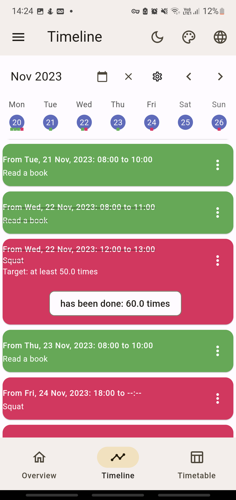
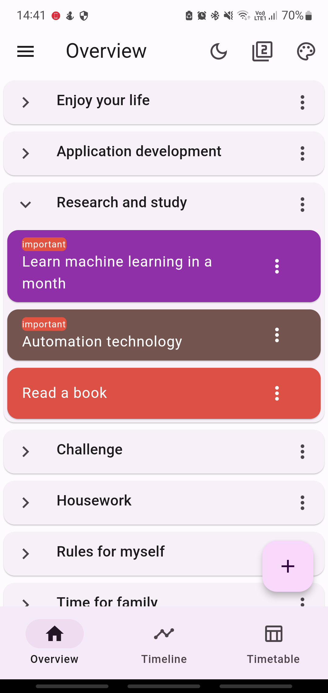
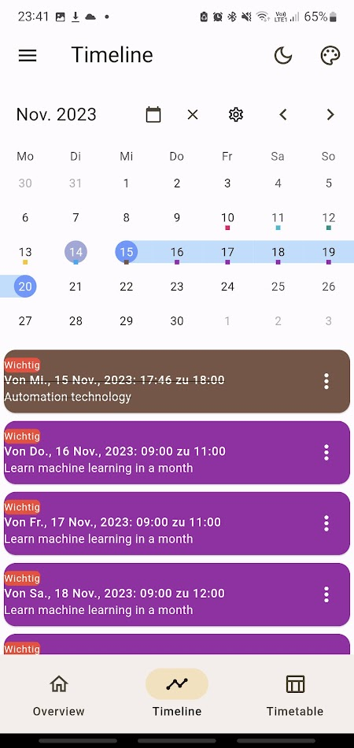
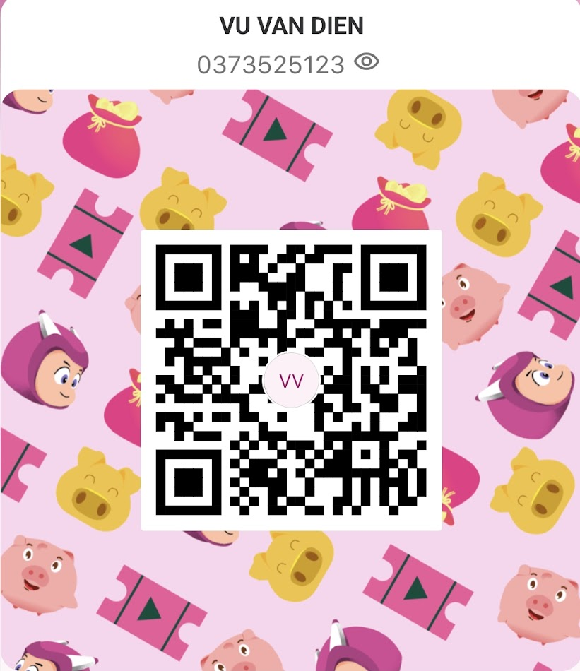

# My Time Manager

We are aiming to create the simplest yet most detailed app to manage your time for all your activities in life. You can use this app as a to-do list, calendar, habit tracker, pomodoro timer for focus mode, and you can review statistics that reflect your efforts at any given time. 

This app is continuously being developed and refined. In the future, the app will be available on multiple platforms such as iOS, MacOS, Windows, Linux... and you will be able to sync data across all platforms.

**Free Version**

**Paid Version**

**THE DIFFERENCE COMPARED TO THOUSANDS OF OTHER TIME MANAGEMENT APPLICATIONS?**

This application can help you create, track, and edit every detail in your long-term plans or daily activities in a flexible and natural way.

For example, in your studies, you need to read a book within a certain period of time.

Day 1:

Time: 9-11am. Read chapters 1,2. Location: school library. Note: remember to bring your student card to borrow books at the library

Time: 3-5pm. Read chapter 3. Location: Cafeteria.

Time: 8-9pm. Continue reading chapter 3. Location: At home.

Day 2:

Time: 8-10am. Read chapter 4. Location: At home.

Day 3:…

You can create a list named 'Research and Study' and add a task 'Read a book' with details as above. When you want to track or change the plan for the task 'Read a book', you just need to click on the item of the task 'Read a book' and review all the details of this task. You can also review the time frames of this task on the daily, weekly, or monthly calendar screens.

Another example for tracking your daily activities. You want to plan for the Squat exercise as below:

Monday:

Time: 6-7pm. Goal: at least 100 times. Location: gym room. Note: don’t forget to bring a water bottle!

Wednesday:

Time: 12-1pm. Goal: at least 50 times. Location: at home.

Friday:

Time: 6pm- unknown end time. Goal: at least 100 times. Location: at home.

Sunday: …

You can create a list named ‘Workout’ and add a quantitative task with the title ‘Squat’ and add all the details in the plan above. Your plans will be displayed as below:

    <table>
        <tr>
            <td style="text-align: center">
                
            </td>            
            <td style="text-align: center">
                
            </td>
            <td style="text-align: center">
                
            </td>
        </tr>
        <tr>
            <td style="text-align: center">
                
            </td>
            <td style="text-align: center">
                
            </td>
            <td style="text-align: center">
                
            </td>
        </tr>
    </table>

**Application view**

    <table>
        <tr>
            <td style="text-align: center">
                
            </td>            
            <td style="text-align: center">
                
            </td>
            <td style="text-align: center">
                
            </td>
        </tr>
        <tr>
            <td style="text-align: center">
                
            </td>
            <td style="text-align: center">
                
            </td>
            <td style="text-align: center">
                
            </td>
        </tr>
    </table>

**See video**

### Still To Do:
This project is continuously being refined. Some interface elements and functions similar to those of Google Calendar, Samsung Calendar, Microsoft To Do, etc., will gradually be added and continuously improved in the future.

* ~~Add measurable tasks and tasks with subtasks models.~~
* ~~Add the function to switch between light and dark mode.~~
* ~~Add the function to select colors for the theme.~~
* ~~Add the function to switch the interface between Material Design 2 and 3.~~
* ~~Add the function to select language.~~
* Add file attachment feature for tasks and events.
* Add alarm feature for tasks and events.
* Add account creation feature and sync data with Firebase.
* Add offline data backup feature.
* Add focus timer and concentration music feature. Create statistical graphs of focused time periods by day, week, month, year.
* Add day, week, month, year views for the calendar. Add a function that allows adding new tasks and events or planning for pre-created tasks and events by clicking on the time slots in the calendar.
* Create widgets to display on the home screen and lock screen.
* Modify widgets for large screen types of tablets, windows, macos.

### Support us
We hope this application will be useful for you in managing your time, helping you achieve many important goals in life, and of course, don’t forget to take time to enjoy your life.

We’re glad to hear that you find the application useful! Your support and feedback are greatly appreciated. If you enjoy using the app, please consider rating it on the app store and sharing it with your friends. This helps us reach more people and continue to improve the app. 

We understand the importance of a clean, ad-free user experience, and we strive to maintain this. However, the development and maintenance of the app do require financial resources. If you’re able to, consider upgrading to the paid version of the software or buying us a cup of coffee. Your support goes a long way in helping us continue to develop and improve the app. Thank you!

